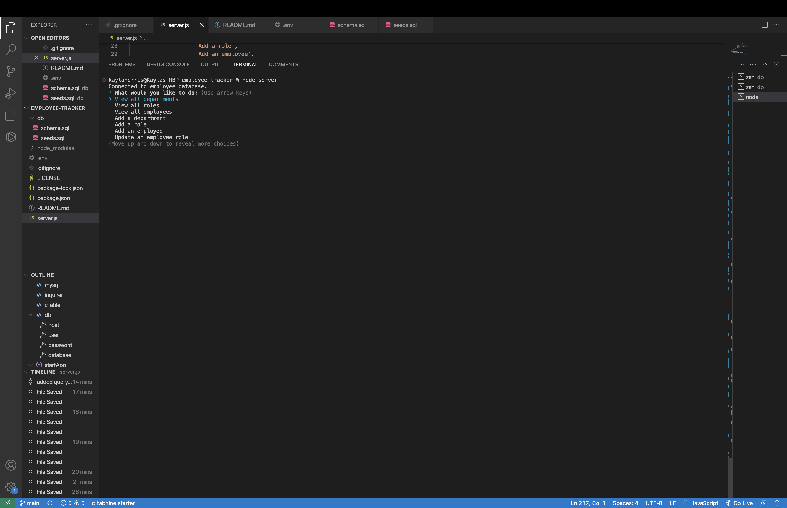

# Employee Tracker

## Description
The purpose of this application is to be able to organize, view, and manage departments, roles, and employees within your company. 

## Table of Contents
- [Employee Tracker](#employee-tracker)
  - [Description](#description)
  - [Table of Contents](#table-of-contents)
  - [Installation](#installation)
  - [Usage](#usage)
  - [Prompts Screenshot](#prompts-screenshot)
  - [Demonstration Video](#demonstration-video)
  - [License](#license)
  - [Questions](#questions)
## Installation

To use this application you will need to have installed VS Code (or a similar code editor), Gitbash (or use the Mac terminal), MySql2, inquirer@8.2.4, and console.table.

To get started: 
- Clone the readme-generator repository by copying the link under the green code button on GitHub and running "git clone " in the terminal
- Then run the "npm init" command
- Then run "npm install" 
- Then run "npm i mysql2"
- Then run "npm i inquirer@8.2.4"
- Then run "npm i console.table"
- Run "node server" to begin the prompts 

## Usage

Once you have the previous steps completed, open the folder in your terminal and run the "node server" command to begin the prompts. Select whichever actions you need to perform from the list.The view all options may be used to reference the different ID's if needed. 

## Prompts Screenshot

## Demonstration Video
[Click here to view video!](https://www.youtube.com/watch?v=Y_HPaRmcfLo)

## License

  
Please refer to the LICENSE file in the repo.

## Questions

For more information, please contact me on [GitHub](https://github.com/KaylaNorris) 
or email me at kayla.e.norris@gmail.com
